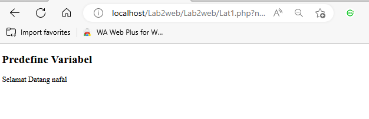
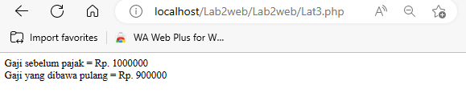
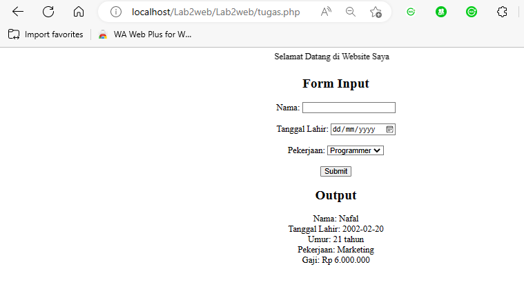

# PEMOGRAMAAN WEB

Diyan Arum Maheswari (312010133)

Teknik Informatika - UNIVERSITAS PELITA BANGSA
______________________________________________

## MELAKUKAN INSTALL PADA XAMPP

Untuk dapat menginstall Xampp kalian dapat menggunakan link ini https://www.apachefriends.org/download.html pada google, dan kemudian setelah terbuka kalian dapat memilih beberapa versi yang sesuai dengan laptop kalian. Dan pilihlah versi portable untuk memudahkan terjadinya proses instalasi nantinya.

Setelah itu kalian dapat melakukan Extract File tersebut dengan menyesuaikan lokasi penyimpanannya seperti gambar dibawah.


## PROSES MENJALANKAN XAMPP

Untuk dapat menjalankan Xampp ini kalian perlu membukanya terlebih dulu, setelah itu kalian klik tombol start pada bagian server Apache, dan tampilan utama Xampp seperti gambar dibaawah ini jika berhasil.


## MEMULAI PHP

Pertama, buatlah folder Lab7_php_dasar pada root directory web server (c:xampp/htdocs)


Setelahnya kalian dapat mengakses directory pada web server seperti gambar dibawah dengan menggunakan URL : http://localhost:8080/Lab7Web/Lab7_php_dasar/


## PHP DASAR


Untuk dapat mendapatkan tampilan seperti gambar diatas, buatlah file baru dengan nama php_dasar.php pada directory tersebut. Kemudian tambahkan kode berikut:

```php
<!DOCTYPE html>
<html lang="en">
<head>
    <meta charset="UTF-8">
    <title>PHP Dasar</title>
</head>
<body>
    <h1>Belajar PHP Dasar</h1>
    <?php
        echo "Hello World";
    ?>
</body>
</html>
```

## VARIABLE PHP


Untuk mendapatkan tampilan seperti diatas kalian bisa menambahkan kode berikut:

```php
<!-- Variabel PHP -->
<h2>Menggunakan Variabel</h2>
    <?php
        $nim = "312110457";
        $nama = 'Nafal Mumtaz Fuadi';
        echo "NIM : " . $nim . "<br>";
        echo "Nama : $nama";
    ?>
```

## PREDEFINE $_GET

Buatlah file baru dalam Directory Lab_php_dasar dengan nama file disini saya namakan dengan Lat1.php dan untuk mengaksesnya dapat menggunakan URL : http://localhost:8080/Lab7Web/Lab7_php_dasar/Lat1.php?nama=%20Diyanarum



Berikut kode yang digunakan:

```php
<!DOCTYPE html>
<html lang="en">
<head>
    <meta charset="UTF-8">
    <meta http-equiv="X-UA-Compatible" content="IE=edge">
    <meta name="viewport" content="width=device-width, initial-scale=1.0">
    <title>PHP Dasar</title>
</head>
<body>
    <!-- Variabel $_GET -->
    <h2>Predefine Variabel</h2>
<?php
    echo 'Selamat Datang'. $_GET['nama'];
?>
</body>
</html>
```

## PEMBUATAN FORM INPUT DENGAN VARIABLE $_POST


Untuk mendapat tampilan diatas, buatlah file baru dengan nama file disini saya namakan Lat2.php dalam directory Lab7_php_dasar. Kemudian tambahkan kode berikut:

```php
<!DOCTYPE html>
<html lang="en">
<head>
    <meta charset="UTF-8">
    <title>PHP Dasar</title>
</head>
<body>
<h2>Form Input</h2>
<form method="post">
    <label>Nama: </label>
    <input type="text" name="nama">
    <input type="submit" value="Kirim">
</form>
<?php
    echo 'Selamat Datang ' . $_POST['nama'];
?>
</body>
</html>
```

## OPERATOR



Untuk mendapat tampilan diatas, buatlah file baru dengan nama file disini saya namakan Lat3.php dalam directory Lab7_php_dasar. Kemudian tambahkan kode berikut:

```php
<!DOCTYPE html>
<html lang="en">
<head>
    <meta charset="UTF-8">
    <meta http-equiv="X-UA-Compatible" content="IE=edge">
    <meta name="viewport" content="width=device-width, initial-scale=1.0">
    <title>PHP Dasar</title>
</head>
<body>
<?php
    $gaji = 1000000;
    $pajak = 0.1;
    $thp = $gaji - ($gaji*$pajak);
        echo "Gaji sebelum pajak = Rp. $gaji <br>";
        echo "Gaji yang dibawa pulang = Rp. $thp";
?>
</body>
</html>
```

## KONDISI IF


Untuk mendapat tampilan pengkondisian IF ELSE seperti diatas, buatlah file baru dengan nama file disini saya namakan Lat4.php dalam directory Lab7_php_dasar. Kemudian tambahkan kode berikut:

```php
<!DOCTYPE html>
<html lang="en">
<head>
    <meta charset="UTF-8">
    <meta http-equiv="X-UA-Compatible" content="IE=edge">
    <meta name="viewport" content="width=device-width, initial-scale=1.0">
    <title>PHP Dasar</title>
</head>
<body>
    <h2>Kondisi IF</h2>
<?php
    $nama_hari = date("l");
        if ($nama_hari == "Sunday") {
            echo "Minggu";
        } elseif ($nama_hari == "Monday") {
            echo "Senin";
        } else {
            echo "Selasa";
        }
?>
</body>
</html>
```

## KONDISI SWITCH


Untuk mendapat tampilan pengkondisian SWITCH CASE dengan break seperti diatas, buatlah file baru dengan nama file disini saya namakan Lat5.php dalam directory Lab7_php_dasar. Kemudian tambahkan kode berikut:

```php
<h2>Kondisi Switch</h2>
<?php
    $nama_hari = date("l");
    switch ($nama_hari) {
        case "Sunday":
            echo "Minggu";
            break;
        case "Monday":
            echo "Senin";
            break;
        case "Tuesday":
            echo "Selasa";
            break;
        default:
            echo "Sabtu";
    }
    echo"/$nama_hari";
?>
```

## PERULANGAN FOR


Untuk mendapat tampilan seperti diatas, buatlah file baru dengan nama file disini saya namakan Lat6.php dalam directory Lab7_php_dasar. Kemudian tambahkan kode berikut:

```php
<!DOCTYPE html>
<html lang="en">
<head>
    <meta charset="UTF-8">
    <meta http-equiv="X-UA-Compatible" content="IE=edge">
    <meta name="viewport" content="width=device-width, initial-scale=1.0">
    <title>PHP Dasar</title>
</head>
<body>
    <h2>Perulangan For</h2>
<?php
        echo "Perulangan 1 sampai 10 <br />";
    for ($i=1; $i<=10; $i++) {
        echo "Perulangan ke: " . $i . '<br />';
    }
        echo "Perulangan Menurun dari 10 ke 1 <br />";
    for ($i=10; $i>=1; $i--) {
        echo "Perulangan ke: " . $i . '<br />';
    }
?>
</body>
</html>
```

## PERULANGAN WHILE


Untuk mendapat tampilan seperti diatas, buatlah file baru dengan nama file disini saya namakan Lat6.php dalam directory Lab7_php_dasar. Kemudian tambahkan kode berikut:

```php
<h2>Perulangan While</h2>
<?php
        echo "Perulangan 1 sampai 10 <br />";
        $i=1;
    while ($i<=10) {
        echo "Perulangan ke: " . $i . '<br />';
        $i++;
    }
?>
```

## PERULANGAN DOWHILE


Untuk mendapat tampilan seperti diatas, buatlah file baru dengan nama file disini saya namakan Lat6.php dalam directory Lab7_php_dasar. Kemudian tambahkan kode berikut:

```php
<h2>Perulangan Dowhile</h2>
<?php
        echo "Perulangan 1 sampai 10 <br />";
        $i=1;
    do {
        echo "Perulangan ke: " . $i . '<br />';
        $i++;
        } while ($i<=10);
?>
```

# PERTANYAAN DAN TUGAS

Buatlah program PHP sederhana dengan menggunakan form input yang menampilkan nama , tanggal lahir dan pekerjaan . Kemudian tampilkan outputnya dengan menghitung umur berdasarkan inputan tanggal lahir . Dan pilihan pekerjaan dengan gaji yang berbeda-beda sesuai pilihan pekerjaan.



Note: Untuk kolom Tanggal Lahir gunakan format : 0000/00/00

```php
<!DOCTYPE html>
<html lang="en">
<head>
    <meta charset="UTF-8">
    <meta http-equiv="X-UA-Compatible" content="IE=edge">
    <meta name="viewport" content="width=device-width, initial-scale=1.0">
    <title>Tugas</title>
</head>
<body>
   <h2>TUGAS</h2>
    <form class="form" method="post" >
            <label>Nama: </label>
            <br>
            <input type="text" name="nama">
            <br>
            <label>Tanggal Lahir: </label>
            <br>
            <input type="text" name="tgl_lahir">
            <br>
            <label>Pekerjaan: </label>
            <br>
            <select name='pekerjaan'>
                <option value="-">>---Pilih Pekerjaan---<</option>
                <option value='Graphic Designer'>Graphic Designer</option>
                <option value='Staff Admin'>Staff Admin</option>
                <option value='HRD'>HRD</option>
                <option value='Maintenance'>Maintenance</option>
                <option value="QC">QC</option>
            </select>
            <br>
            <br>
            <button type="submit">Kirim</button>
    </form>
    <h2>HASIL</h2>

    <?php
        # Memanggil Nama
        echo 'Nama: ' . $_POST['nama'];

        # Merubah Tanggal Lahir menjadi Umur (Tahun)
        $tgl_lahir = @$_POST['tgl_lahir'];

        $lahir = new DateTime($tgl_lahir);
        $hari_ini = new DateTime();

        $diff = $hari_ini->diff($lahir);

        # Memanggil fungsi umur yg sudah dibuat diatas
        echo "<br> Umur: ". $diff->y ." Tahun";

        # Memanggil pekerjaan
        echo "<br> Pekerjaan: ". $_POST['pekerjaan'];

        # Kondisi if pekerjaan untuk menentukan gaji
        $pekerjaan = @$_POST['pekerjaan'];

        if($pekerjaan == "Graphic Designer"){
            echo '<br> Gaji: Rp. 15.000.000,-';
        }elseif($pekerjaan == "Staff Admin"){
            echo '<br> Gaji: Rp. 7.500.000,-';
        }elseif($pekerjaan == "HRD"){
            echo '<br> Gaji: Rp. 10.000.000,-';
        }elseif($pekerjaan == "Maintenance"){
            echo '<br> Gaji: Rp. 9.000.000,-';
        }elseif ($pekerjaan == "QC"){
            echo '<br> Gaji: Rp. 7.000.000,-';
        }

    ?>
  </body>
</html>
```

# <P align="center"> THANK'S FOR YOUR ATTENTION!! SEE YOU!!
